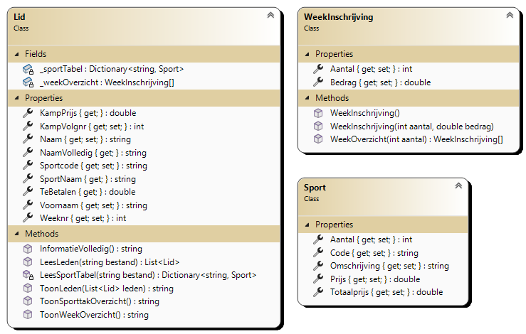
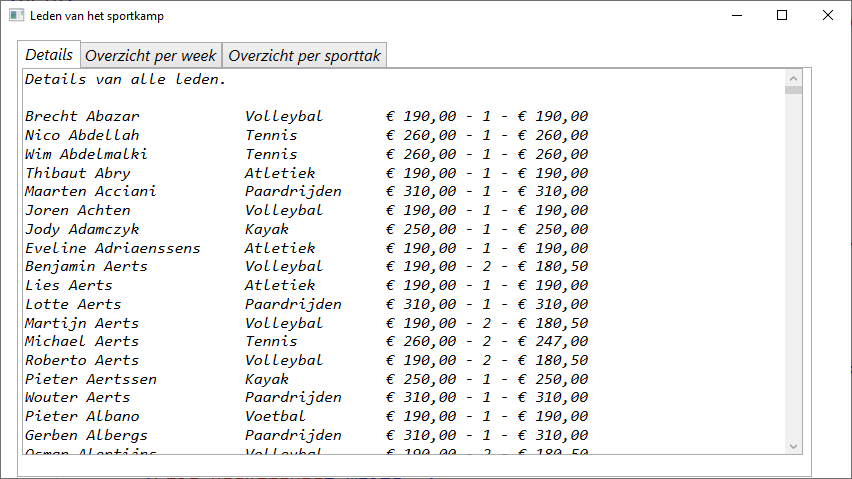
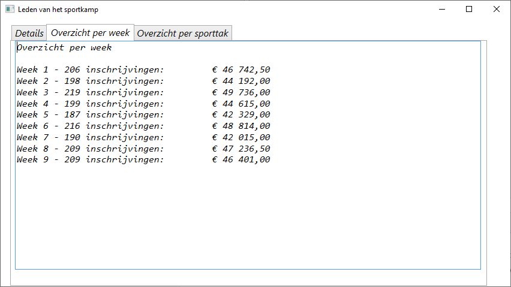
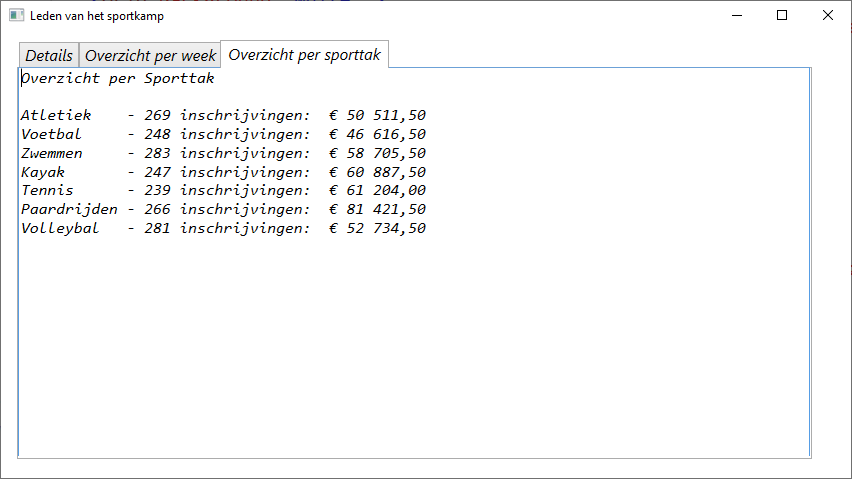

Deze toepassing maakt gebruik van een tekstbestand "LedenSportkamp.txt" waarin de gegevens van deelnemers zijn opgenomen die deelnemen aan een sportkamp.

- In de eerste 30 posities staat de naam van de deelnemer.
- Dan volgt de voornaam van de deelnemer (ook 30 posities).
- Op de 61ste positie staat een cijfer (maximum 9) dat aangeeft in welke vakantieweek de betreffende persoon aan een sportkamp deelneemt. (begin juli 🡪1, eind augustus 🡪 9).
- De 62ste tot en met de 64ste positie bevat de code van het gevolgde sportkamp. Deze codes zijn opgenomen in het bestand "sporten.txt".
- Tenslotte staat op de 65ste positie terug een cijfer (maximum 9) dat aangeeft de hoeveelste keer deze deelnemer aan een sportkamp deelneemt.

Je mag er van uitgaan dat bij deze structuur nooit fouten zijn en dat het bestanden aanwezig zijn. Het aantal records in het tekstbestand is niet vast.

Maak de classes aan volgens onderstaand schema:

Je maakt voor deze toepassing de (basisklasse) **Lid** met als eigenschappen:
- **Naam** (string)
- **Voornaam** (string)
- **Sportcode** (string)
- **Weeknr** (int)
- **KampVolgnr** (int)

Tevens zijn er de (uitsluitend te lezen) eigenschappen **NaamVolledig**, **SportNaam**, **KampPrijs** en **TeBetalen.**

**NaamVolledig** geeft als resultaat een string met de achternaam, gevolgd door 1 blanco en de voornaam (zonder extra blanco's achteraan).

**SportNaam** geeft als resultaat een string met de omschrijving van de sporttak waarvoor een lid is ingeschreven (zie tabel op vorige pagina).

**KampPrijs** geeft als resultaat een double met de "normale" prijs van de sporttak waarvoor een lid is ingeschreven (zie tabel op vorige pagina).

**TeBetalen** geeft eveneens als resultaat een double met de prijs die het lid moet betalen. Deze prijs is de Kampprijs, waarop eventueel een korting wordt toegepast: wie minstens voor de 5^de^ keer een sportkamp volgt (zie KampVolgnr) krijgt een korting van 10%, wie minstens voor de 2^de^ keer een sportkamp volgt (maar minder dan 5), krijgt een korting van 5%.

Er is ook nog de methode **InformatieVolledig()**. Deze methode geeft als resultaat een string met vooraan de inhoud van NaamVolledig (rechts aangevuld met blanco's tot een totaal van 35 posities), dan de SportNaam (aangevuld met blanco's tot een totaal van 15 posities), daarna de KampPrijs (normale prijs), dan de waarde van KampVolgnr en ten slotte de inhoud van TeBetalen.

Maak een venster SportkampLeden dat een tabControl bevat met 3 tabbladen (tabPages): Details, Overzicht per week en Overzicht per sporttak. Deze bevatten respectievelijk de tekstvakken TxtDetails, TxtOverzichtWeek en TxtOverzichtSport

Bij de start van het programma worden onmiddellijk alle records uit het bestand "LedenSportkamp.txt" gelezen. Per record wordt een Lid-object gecreëerd.

Bij de start worden ook onmiddellijk de tekstvakken in de tabbladen gevuld, zoals weergegeven in volgende schermafdrukken:

Het bepalen van de inhoud van het tekstvak TxtOverzichtSport (in het tabblad Overzicht per sporttak) is wat meer uitdagend.

Je kan eventueel ook nog de omschrijvingen en prijzen van de sporttakken inlezen uit een bestand "Sporten.txt":

Deze gegevens kan je inlezen in een tabel (array) of een list. Je kan hiervoor eventueel zelfs een nieuwe klasse Sport met de eigenschappen Code (sportcode), Omschrijving (omschrijving van de sporttak), Prijs (inschrijvingsbedrag voor de sporttak), Aantal (numerieke integer waarde om bij te houden hoeveel inschrijvingen er zijn voor de betreffende sporttak) en Totaalprijs (numerieke double waarde om bij te houden hoeveel het totale inschrijvingsbedrag is voor de betreffende sporttak)
